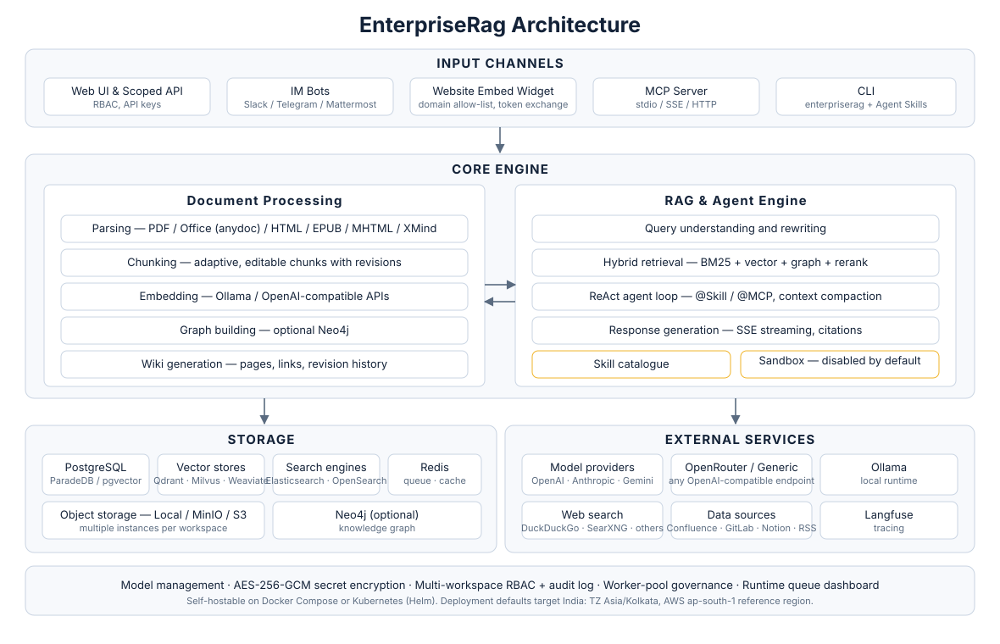

<p align="center">
  <picture>
    
  </picture>
</p>

<p align="center">
    <a href="https://DOMAIN_PLACEHOLDER" target="_blank">
        
    </a>
    <a href="https://github.com/ORG_PLACEHOLDER/EnterpriseRag/blob/main/LICENSE">
        
    </a>
    <a href="./CHANGELOG.md">
        
    </a>
</p>

<p align="center">
  <h4 align="center">

  [Overview](#-overview) • [Architecture](#-architecture) • [Feature Overview](#-feature-overview) • [Getting Started](#-getting-started) • [API Reference](#-api-reference) • [Developer Guide](#-developer-guide)
  
  </h4>
</p>

# 💡 EnterpriseRag — Turn Documents into Living Knowledge with RAG, Agents and Auto-Wiki

## 📌 Overview

[**EnterpriseRag**](https://DOMAIN_PLACEHOLDER) is an open-source, LLM-powered knowledge framework built for enterprise-grade document understanding, semantic retrieval, and autonomous reasoning.

It is organised around three core capabilities: **RAG-based Quick Q&A** for everyday lookups, a **ReAct Agent** that autonomously orchestrates retrieval, MCP tools, a **workspace skill catalogue** and web search to handle complex multi-step tasks, and **Wiki Mode**, in which agents distil raw documents into a self-maintaining, interlinked Markdown knowledge base with an interactive knowledge graph, manual editing, revision history and one-click rollback. **Cross-session long-term memory** remembers who you are and what you keep asking about. Knowledge curation is equally hands-on: a **tree-structured folder view** preserves the directory layout of uploads, and **chunk editing with revision history** lets retrieval chunks be edited, diffed and reverted like documents. Combined with multi-source ingestion (Confluence / GitLab / Notion / RSS), **website embed widgets** for publishing agents to external sites, **scoped API keys with a principal model** for programmatic integrations, **multi-instance storage backends** per workspace, full Langfuse observability plus a **runtime task-queue dashboard with worker-pool governance**, **enterprise-ready multi-workspace RBAC** (4-tier role matrix + per-resource ownership + per-workspace audit log), and a fully self-hostable modular architecture, EnterpriseRag turns scattered documents into a queryable, reasoning-capable, continuously evolving knowledge asset.

The framework auto-syncs knowledge from Confluence, GitLab, Notion and RSS feeds, handles 10+ document formats including PDF, Word, images, Excel and XMind, and can serve Q&A directly through Slack, Telegram and Mattermost. Model access goes through the **OpenAI**, **Anthropic**, **Gemini**, **OpenRouter** and **Generic** (OpenAI-compatible) providers, plus a local **Ollama** runtime — so any endpoint that speaks one of those wire protocols is usable without a bespoke integration. Office files can be parsed in-process with **anydoc**. Its fully modular design allows swapping LLMs, vector databases and storage backends, with support for local and private cloud deployment ensuring complete data sovereignty. EnterpriseRag also integrates with **Langfuse** for comprehensive observability into agent reasoning, token usage and pipeline tracing.

> **Code-execution sandbox.** The bundled skill sandbox ships **disabled by default**. The
> previous hosted sandbox runtime was removed from this distribution and its adapter now
> reports `sandbox: no execution runtime configured` unless `ENTERPRISERAG_SANDBOX_ENABLED=true`
> is set. The Docker backend is likewise off until `ENTERPRISERAG_SANDBOX_DOCKER_ENABLED=true`
> and a Docker socket are supplied — mounting that socket is equivalent to granting host root,
> so it is for single-machine private deployments only. A replacement runtime with its own
> threat model is tracked as a separate follow-up.


## ✨ Latest Updates

- **Skill catalogue and sandbox runtime** — install skills from git or a zip archive, snapshot them per sandbox configuration, browse and edit sandbox files, and scope workspace or personal environment variables. The execution runtime is off by default (see the note above).
- **Cross-session long-term memory** — profile / preference / fact / task / interest extraction with user confirmation and an on-demand `search_memory` tool.
- **In-process anydoc office parser** and XMind parsing, plus chat artifacts, question outlines and message timestamps.
- **Knowledge base folder tree** — uploads keep their original directory structure and can be browsed, renamed and re-filed like a file manager.
- **Chunk editing with revision history** — edit retrieval chunks in the UI with per-version diff, rollback and automatic reindexing.
- **Wiki page revision history** — snapshots, line-level diff, one-click rollback and in-browser editing.
- **Scoped API keys and a principal model** — capability-level grants, per-KB restriction and an API integration playground.
- **Runtime task-queue dashboard** — queue depth, per-model concurrency governors and failed-task inspection with manual retry.
- **Multi-instance storage backends** — several storage instances per workspace with per-KB binding and a default instance.
- **Workspace RBAC** — Owner / Admin / Contributor / Viewer, per-KB ownership and a per-workspace audit log.

The full release history, including the upstream releases this distribution is derived from, lives in [`CHANGELOG.md`](./CHANGELOG.md).


## 📱 Interface Showcase

> **Screenshots are pending regeneration.** The screenshots shipped by the upstream
> project showed a Chinese-locale UI under the previous brand, so they have been
> removed rather than reused. Fresh captures of the English UI will be added once a
> populated demo instance is available — run the stack locally (see
> [Getting Started](#-getting-started)) to see the current interface.

## 🏗️ Architecture



Fully modular pipeline from document parsing, vectorization, and retrieval to LLM inference — every component is swappable and extensible. Supports local / private cloud deployment with full data sovereignty and a zero-barrier Web UI for quick onboarding.

## ⚙️ Why Go + Python? The Right Language for Each Job

EnterpriseRag is deliberately polyglot: each language handles the part it is best at.

| Layer | Language | Where | Responsibility |
| --- | --- | --- | --- |
| Core service | **Go** (Gin) | [`cmd/`](./cmd), [`internal/`](./internal) | HTTP API, agent & chat orchestration, retrieval, storage and vector-store access, task queues |
| Document reader | **Python** | [`docreader/`](./docreader) | Parsing (PDF, DOCX, …), OCR, layout analysis, chunking; exposed to the core via gRPC ([`docreader/proto`](./docreader/proto)) |

### Why the core is written in Go

1. **Built for concurrency** — a RAG server spends most of its time waiting on I/O: embedding calls, LLM streaming, vector DB queries and parallel retrieval. Goroutines handle thousands of these at once cheaply, without the GIL or async plumbing Python would need.
2. **First-class streaming** — pushing LLM tokens to the browser over SSE is simple and reliable with Go's `net/http` and Gin.
3. **Effortless deployment** — Go compiles to a single static binary: small Docker images, fast startup and low memory use. That suits on-prem and private-cloud installs via [Docker](./docker) and [Helm](./helm).
4. **Maintainable at scale** — static typing and compile-time checks keep a large, integration-heavy codebase safe to refactor.
5. **The heavy ML happens elsewhere** — embeddings, reranking and generation are served by external model APIs or model servers. The core coordinates calls and moves data, so it doesn't need Python's ML libraries.

### Why document parsing stays in Python

The strongest document-parsing tools are Python libraries, such as markitdown, pypdf / pypdfium2, python-docx, openpyxl, trafilatura and Playwright for web pages. Rather than port them, EnterpriseRag keeps them in their own service behind a gRPC interface, so that component can scale and evolve independently.

> **In short:** Go runs the high-concurrency service layer, and Python runs the ML-heavy document processing.

## 🧩 Feature Overview

**Intelligent Conversation**

| Capability | Details |
|------------|---------|
| Intelligent Reasoning | ReACT progressive multi-step reasoning, autonomously orchestrating knowledge retrieval, MCP tools, skill sandboxes, and web search |
| Quick Q&A | RAG-based Q&A over knowledge bases for fast and accurate answers |
| Wiki Mode | Agent-driven auto-generation of structured, interlinked markdown Wiki pages from raw documents; in-browser manual editing, page revision history, line-level diff and one-click rollback |
| Skill Catalogue & Sandbox | Workspace skill catalogue (git / zip) installed onto session-persistent sandbox configurations; `shell_exec`, file tools, artifacts and a per-config network policy. **No execution runtime ships enabled** — the Docker backend is opt-in via `ENTERPRISERAG_SANDBOX_DOCKER_ENABLED`, and the removed hosted runtime reports unavailable |
| Long-term Memory | Cross-session memory (profile / preference / fact / task / interest) with auto-extract, user confirm, and on-demand `search_memory` |
| Tool Calling | Built-in tools, MCP tools (incl. OAuth2 remote services, mid-conversation OAuth), web search; `@Skill / @MCP` mentions to scope the agent runtime per turn |
| Conversation Strategy | Online Prompt editing, retrieval threshold tuning, multi-turn context awareness, per-agent citation output toggle |
| Suggested Questions | Auto-generated question suggestions and after-answer follow-ups based on knowledge base content |
| Temporary Attachments | Session-scoped image / document uploads with async parsing for one-off Q&A, with a combined image + attachment limit |
| Citations & RAG Progress | Inline citation popovers and a references drawer (web / KB source distinction), shared markdown rendering, and stage-by-stage RAG pipeline progress in chat |
| Session Management | Filter and group sidebar sessions by source (Web / IM / Embed), with inline session-title rename |

**Knowledge Management**

| Capability | Details |
|------------|---------|
| Knowledge Base Types | FAQ / Document / Wiki with folder import, URL import, multi-tag management, and online entry |
| Folder Tree | Folder uploads keep their original directory structure, with a sidebar tree for browsing, folder rename, and re-filing documents into another folder |
| Chunk Editing & Revisions | Edit retrieval chunks directly in the UI with per-version snapshots, diff and one-click rollback, and automatic reindexing after an edit; generated questions can be added, edited, deleted and regenerated; custom document metadata supported |
| Per-Upload Process Config | Override parser, chunking, multimodal (VLM / ASR), graph extraction, and question generation per upload batch via upload-confirm dialog or `process_config` API; reparse with new settings |
| Batch Reparse | Re-queue parsing for multiple documents at once with optional per-batch `process_config` |
| Data Source Import | Auto-sync from Confluence / GitLab / Notion / RSS feeds; incremental and full sync |
| Document Formats | PDF / Word / Txt / Markdown / HTML / EPUB / MHTML / Images / CSV / Excel / PPT / JSON / XMind |
| Auto-Tagging | After parse, pick matching tags from the knowledge base's existing set without creating tags or overwriting manual ones |
| Retrieval Strategies | BM25 sparse / Dense retrieval / GraphRAG / parent-child chunking / HNSW-accelerated pgvector (1024-dim) / multi-dimensional indexing |
| Batch Selection & Tagging | Marquee drag-select multiple documents in the KB list for batch reparse and batch tagging (common tags pre-selected) |
| E2E Testing | Full-pipeline visualization with recall hit rate, BLEU / ROUGE metric evaluation |

**Integrations & Extensions**

| Capability | Details |
|------------|---------|
| LLMs | Five model providers — **OpenAI**, **Anthropic**, **Gemini**, **OpenRouter** and **Generic** (any OpenAI-compatible endpoint) — plus a local **Ollama** runtime |
| Embeddings | Ollama (local) / BGE / GTE / OpenAI-compatible embedding APIs; Gemini and Cohere-style rerankers over the same provider set |
| Vector DBs | PostgreSQL (pgvector, the ParadeDB default) / Qdrant / Milvus / Weaviate / Elasticsearch / OpenSearch / SQLite (`sqlite-vec`, single-binary deployments) |
| Object Storage | Local filesystem / MinIO / AWS S3 (IAM Role / IRSA default credential chain, and any S3-compatible endpoint); **multiple storage instances per workspace** with per-KB binding and a default instance |
| IM Channels | Slack / Telegram / Mattermost |
| Website Embed | Publish agents via embed widget with domain allowlists, rate limits, and secure-mode token exchange |
| Web Search | DuckDuckGo / SearXNG (self-hosted) / Serply / Brave / Bing / Google / Tavily / Exa / Keenable / Ollama |
| API Integration | Scoped API keys (capability-level grants + per-KB restriction + throttled last-used tracking) with an API integration playground; MCP OAuth and embed sessions isolated per principal; `resource_urls=public` returns directly loadable file/image URLs, removing the second authenticated proxy call |
| MCP Server | Official PyPI package `PYPI_NAME_PLACEHOLDER` with 29 tools over stdio / SSE / HTTP transports |

**Platform**

| Capability | Details |
|------------|---------|
| Deployment | Local / Docker / Kubernetes (Helm) with private and offline support |
| UI | Web UI / RESTful API / CLI (`enterpriserag`) / Website Embed Widget |
| Access Control | Workspace RBAC with 4-tier role matrix (Owner / Admin / Contributor / Viewer), per-KB resource ownership, per-workspace audit log, invite-only workspaces, tenantless provisioning & gated self-service workspace creation, admin password reset (session revocation), cross-workspace superuser, scoped API keys |
| Security | AES-256-GCM at-rest encryption for API keys and MCP / data-source credentials with graceful key rotation; gRPC TLS + Token between app and docreader; Redis TLS; SSRF-safe HTTP client (data sources, URL import, redirect chains); secret redaction in responses; skill sandbox isolation (Docker opt-in) with per-config network policy; OIDC ID-token JWKS verification; optional complex-password policy |
| Observability | Integrated Langfuse (sole tracing backend) for ReAct loops, token tracking, tool calls, and pipeline tracing; built-in Langfuse-style document parsing trace timeline with stage-by-stage progress; system-admin runtime task-queue dashboard (queue depth, per-model concurrency, failed-task inspection & manual retry) |
| Task Management | MQ async tasks with per-stage worker-pool governance (core / post-process / enrichment / maintenance + elastic shared pool, plus an independent Wiki pool) and per-model background concurrency governors; automatic database migration on version upgrade |
| Model Management | Centralized config, declarative built-in models via YAML, per-knowledge-base model selection, per-model thinking-mode and embedding-dimension overrides, interactive model test debugger, multi-workspace built-in model sharing |

## ⌨️ Command-Line Interface

`enterpriserag` is the official CLI for driving the API from a terminal or an AI
agent. It is **agent-first**: every command emits a stable JSON envelope by
default (with typed error codes mapped to exit codes), and `--format text`
renders for humans. It also serves a curated MCP tool surface
(`enterpriserag mcp serve`) and ships bundled Agent Skills.

```bash
enterpriserag profile add prod --host https://kb.example.com --use
enterpriserag auth login
enterpriserag kb list
enterpriserag link --kb my-knowledge-base    # bind the current directory
enterpriserag doc upload notes.md
enterpriserag chat "summarise the design doc"
```

For headless / CI use, set `ENTERPRISERAG_API_KEY` + `ENTERPRISERAG_HOST` and skip
`auth login` entirely — no credentials written to disk.

See [`cli/README.md`](./cli/README.md) for install + 5-minute quickstart and
[`cli/AGENTS.md`](./cli/AGENTS.md) for the operational contract AI agents rely on.

## 🚀 Getting Started

### 🛠 Prerequisites

- [Docker](https://www.docker.com/) & [Docker Compose](https://docs.docker.com/compose/)
- [Git](https://git-scm.com/)

### ⚡ Quick Start: one command

`start.sh` builds the images from your local source, starts the full stack, waits
until the backend is healthy, and opens the browser.

```bash
./start.sh              # macOS / Linux / Git Bash
.\start.ps1             # Windows PowerShell (runs start.sh through Git Bash)
```

> On Windows, don't run `bash ./start.sh` from PowerShell. There, `bash` starts WSL, and WSL
> often has no usable Linux distro (Docker Desktop's internal one doesn't include bash). Use
> `.\start.ps1` instead, or open Git Bash and run `./start.sh`. `start.ps1` accepts the same
> arguments, for example `.\start.ps1 --rebuild`.

On the first run, `start.sh` builds the `app`, `ui` and `docreader` images, which takes
roughly 10–20 minutes. Later runs reuse those images. When it finishes, the Web UI is at
**http://localhost** and the API at **http://localhost:8080**.

| Command | What it does |
|---------|--------------|
| `./start.sh` | Build the images if they are missing, then start everything |
| `./start.sh --rebuild` | Rebuild the images after code changes, then start |
| `./start.sh stop` | Stop all services, including optional profiles |
| `./start.sh restart` | Stop, then start |
| `./start.sh logs` | Follow the container logs |
| `./start.sh status` | Show container status |

How it behaves:

- If `.env` is missing, it creates one from `.env.example`.
- It stops with an error if ports `FRONTEND_PORT` (default 80) or `APP_PORT` (default 8080) are already in use.
- It turns on the `langfuse` profile automatically when `LANGFUSE_PUBLIC_KEY` is set in `.env`.
- To add more profiles, set `COMPOSE_PROFILES` before the command: `COMPOSE_PROFILES=qdrant,minio ./start.sh`
- The locally built images are named `sustainability-ai/enterpriserag-*:local`. `start.sh` does this
  through a generated `docker-compose.local.yml`, so you don't need to replace `ORG_PLACEHOLDER` first
  (see the note below). To use a different namespace, set `LOCAL_IMAGE_NS=<name>`.

### 📦 Installation & Launch (manual)

> **Before the first run:** this tree still carries the distribution placeholders
> `ORG_PLACEHOLDER`, `DOMAIN_PLACEHOLDER`, `EMAIL_PLACEHOLDER`, `NPM_SCOPE_PLACEHOLDER` and
> `PYPI_NAME_PLACEHOLDER`. The Compose image names are built from `ORG_PLACEHOLDER`, and
> Docker rejects an uppercase repository name, so **`docker compose pull` and
> `docker compose up` fail until `ORG_PLACEHOLDER` is replaced with your own lowercase
> registry namespace.** Substitute the placeholders first, then build or publish the
> `enterpriserag-{app,ui,docreader,sandbox}` images.

```bash
git clone https://github.com/ORG_PLACEHOLDER/EnterpriseRag.git
cd EnterpriseRag
cp .env.example .env   # Edit .env as needed, see comments in the file
docker compose build    # Build the app / ui / docreader images locally
docker compose up -d    # Start core services
```

Once started, visit **http://localhost** to get started.

> To use a local Ollama model, run `ollama serve > /dev/null 2>&1 &` first.

### 🔄 Upgrading

If you already have EnterpriseRag running and downloaded a newer release:

```bash
# Set ENTERPRISERAG_VERSION in .env to the target release (e.g. 0.7.0), or keep latest
docker compose pull     # Pull images matching ENTERPRISERAG_VERSION
docker compose up -d    # Recreate containers with new images
```

> `docker compose up -d` alone reuses locally cached images and may leave the UI version out of sync with the release you downloaded.

### 🔧 Optional Services (Docker Compose Profiles)

Add `--profile` flags to enable additional components. Multiple profiles can be combined:

| Profile | Description | Command |
|---------|-------------|---------|
| _(default)_ | Core services | `docker compose pull && docker compose up -d` |
| `full` | All features | `docker compose --profile full pull && docker compose --profile full up -d` |
| `neo4j` | Knowledge Graph (Neo4j) | `docker compose --profile neo4j pull && docker compose --profile neo4j up -d` |
| `minio` | Object Storage (MinIO) | `docker compose --profile minio pull && docker compose --profile minio up -d` |
| `qdrant` | Vector store (Qdrant) | `docker compose --profile qdrant pull && docker compose --profile qdrant up -d` |
| `milvus` | Vector store (Milvus) | `docker compose --profile milvus pull && docker compose --profile milvus up -d` |
| `weaviate` | Vector store (Weaviate) | `docker compose --profile weaviate pull && docker compose --profile weaviate up -d` |
| `searxng` | Self-hosted web search (SearXNG) | `docker compose --profile searxng pull && docker compose --profile searxng up -d` |
| `langfuse` | Tracing (Langfuse) | `docker compose --profile langfuse pull && docker compose --profile langfuse up -d` |

Combine profiles: `docker compose --profile neo4j --profile minio pull && docker compose --profile neo4j --profile minio up -d`

Stop services: `docker compose down`

### 🌐 Service URLs

| Service | URL |
|---------|-----|
| Web UI | `http://localhost` |
| Backend API | `http://localhost:8080` |
| Langfuse Tracing | `http://localhost:3000` |

## MCP Server

Please refer to the [MCP Configuration Guide](./mcp-server/MCP_CONFIG.md) for the necessary setup.

## 📘 API Reference

The HTTP API is described by the OpenAPI specification generated from the handler
annotations: [`docs/swagger.yaml`](./docs/swagger.yaml) and
[`docs/swagger.json`](./docs/swagger.json). Run `make docs` to regenerate them. With the
stack running in `debug` mode, the interactive Swagger UI is served at
`http://localhost:8080/swagger/index.html`.

## 🧭 Developer Guide

### 🧰 The Makefile — Task Index

Almost every workflow below is a `make` target. The [`Makefile`](./Makefile) is not a
build system in the classic sense — it is a single discoverable index over the shell
scripts in [`scripts/`](./scripts), `docker compose`, and the `go build` invocations,
with the non-obvious flags already pinned (version/commit ldflags, the
qdrant/milvus protobuf conflict policy, the macOS duplicate-library linker workaround).

```bash
make help          # print every target with a one-line description
make show-platform # report the detected architecture and Docker build platform
make check-env     # validate the environment configuration before starting
```

> **Windows users:** the recipes are POSIX shell — they call `uname`, `[ -f … ]`,
> `eval $(…)` and `./scripts/*.sh`, so they do not run under PowerShell or `cmd`.
> Use **Git Bash** or **WSL** with GNU Make installed, or invoke the underlying
> scripts directly (`./scripts/dev.sh start`, `./scripts/migrate.sh up`) — that is
> all the targets do.

### ⚡ Fast Development Mode (Recommended)

If you need to frequently modify code, **you don't need to rebuild Docker images every time**! Use fast development mode:

```bash
# Start infrastructure
make dev-start

# Start backend (new terminal)
make dev-app

# Start frontend (new terminal)
make dev-frontend
```

**Development Advantages:**
- ✅ Frontend modifications auto hot-reload (no restart needed)
- ✅ Backend modifications quick restart (5-10 seconds, supports Air hot-reload)
- ✅ No need to rebuild Docker images
- ✅ Support IDE breakpoint debugging

### 🔨 Build & Run Modes

The project can be run five different ways. Pick one:

| Mode | Command | When to use |
|------|---------|-------------|
| Fast development | `make dev-start` + `make dev-app` + `make dev-frontend` | Day-to-day work (see above) |
| Full stack in Docker | `make start-all` / `make stop-all` | Reproduce the deployed topology |
| Plain local binary | `make build` then `make run` | Quick backend-only check |
| Lite edition | `make run-lite` | Single binary, SQLite + in-memory queue, no external services |
| Production binary | `make build-prod` | Stripped binary with version metadata stamped in |

Useful variants:

```bash
make dev-start DEV_ARGS=--odl-hybrid   # pass extra flags through to scripts/dev.sh
make start-ollama                      # bring up only the Ollama service
make dev-logs / make dev-status        # tail logs, inspect the dev environment
SKIP_FRONTEND=1 make build-lite        # skip the npm build when only Go changed
make package-lite                      # tarball the Lite release
make package-mac-app                   # build the macOS .app bundle
```

`run-lite` requires a `.env.lite` file in the repository root and fails fast without one.

**Optional `anydoc` parser engine.** The in-process office-document parser is a Rust
static library linked behind a build tag. Build the archive first, then the binary:

```bash
make anydoc-lib                        # build the Rust archive (needs the Rust toolchain)
make build-anydoc                      # go build -tags anydoc
make build-prod GO_BUILD_TAGS=anydoc   # or link it into the production build
```

Once `make anydoc-lib` has run, `make dev-app` links the engine automatically.

### 🗄 Database Migrations

```bash
make migrate-up                        # apply all pending migrations
make migrate-down                      # roll back
make migrate-version                   # show the current schema version
make migrate-create name=add_foo_table # scaffold a new migration pair
make migrate-goto version=3            # migrate to a specific version
make migrate-force version=4           # clear a dirty state (use with care)
```

`make clean-db` removes the Postgres, MinIO and Redis Docker volumes — **this destroys
all local data.**

### 📦 Images & Packaging

```bash
make build-images                      # build every image from source
make build-images-app                  # or one at a time: app / docreader / frontend
make docker-build-all                  # direct `docker build` path (bypasses the helper script)
make pull-images                       # pull the published images
make list-containers                   # show what is currently running
make clean-images                      # remove the locally built images
```

> These targets tag images under `ORG_PLACEHOLDER/enterpriserag-*`. As noted in
> [Installation & Launch](#-installation--launch), replace `ORG_PLACEHOLDER` with your own
> lowercase registry namespace before pushing or pulling — Docker rejects uppercase
> repository names.

### ✅ Checks & Generated Artefacts

```bash
make fmt / make lint / make test       # the maintainer gate (see Contributing below)
make deps                              # go mod download
make docs                              # regenerate the Swagger spec into ./docs
make install-swagger                   # install the swag CLI that `make docs` needs
```

When adding a model vendor or editing any `models.json`, validate the catalogue:

```bash
make model-catalog-check                     # invariants, legacy parity, vendor facts
make model-catalog-diff                      # report drift against models.dev
make model-catalog-diff VENDOR=openrouter    # scope the diff to one vendor
```

`model-catalog-diff` is a review aid only — it fetches nothing at runtime and writes
nothing automatically. Check each reported difference against the vendor's own
documentation before acting on it.


## 🤝 Contributing

Welcome to submit [Issues](https://github.com/ORG_PLACEHOLDER/EnterpriseRag/issues) or Pull Requests.

**Process:** Fork → Create branch → Commit changes → Open PR

**Standards:** Format code with `gofmt`, follow [Conventional Commits](https://www.conventionalcommits.org/) (`feat:` / `fix:` / `docs:` / `test:` / `refactor:`)

### Validation

For a focused PR, validate the changed scope first:

```bash
git fetch origin main
git diff --check origin/main...HEAD
golangci-lint run --new-from-rev=origin/main ./...
go test ./path/to/changed/package -count=1
```

Run `gofmt` on changed Go files before committing. For frontend changes, run the relevant tests from `frontend/` and use `npm run type-check` when the change affects TypeScript or Vue components.

The full maintainer gate remains:

```bash
make fmt
make lint
make test
```

`make fmt` formats the entire Go repository, so run it only with a clean worktree and review the resulting diff. Some full-suite tests require local infrastructure or service configuration. If a full check fails for an unrelated baseline or environment reason, include the exact command and failure in the PR while still providing passing targeted tests for your change.

## 🔒 Security Notice

**Important:** EnterpriseRag requires login authentication. For production deployments, we strongly recommend:

- Deploy EnterpriseRag services in internal/private network environments rather than public internet
- Avoid exposing the service directly to public networks to prevent potential information leakage
- Configure proper firewall rules and access controls for your deployment environment
- Regularly update to the latest version for security patches and improvements
- Leave the skill sandbox disabled unless a runtime with a reviewed threat model has been wired in

## 👥 Contributors

Thanks to these excellent contributors:

[](https://github.com/ORG_PLACEHOLDER/EnterpriseRag/graphs/contributors)

## 📄 License

This project is licensed under the [MIT License](./LICENSE).
You are free to use, modify, and distribute the code with proper attribution.
